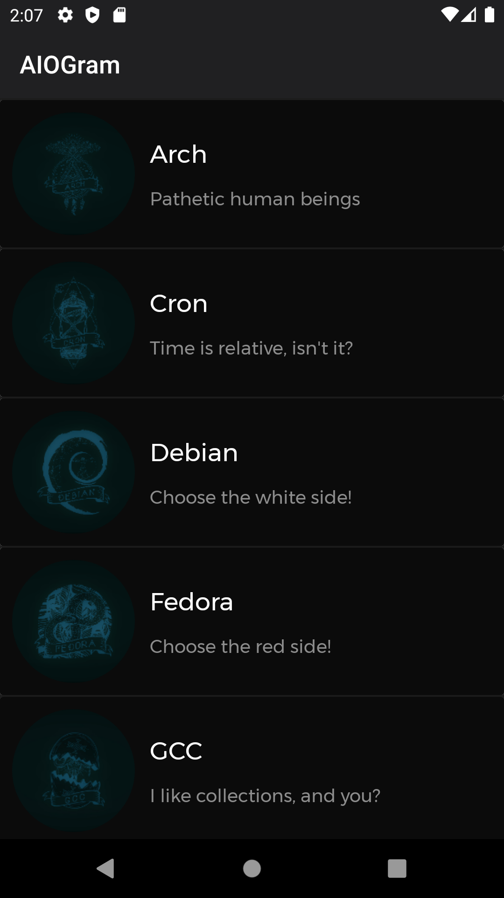
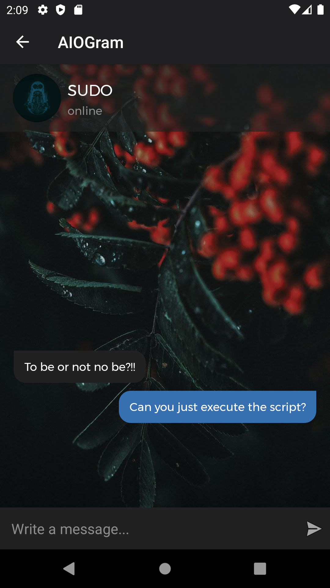

# chat-app

<figure class="video_container">
  <video controls="true" allowfullscreen="true" poster="./screenshots/Screenshot_1">
    <source src="./screenshots/app.webm" type="video/webm">
  </video>
</figure>